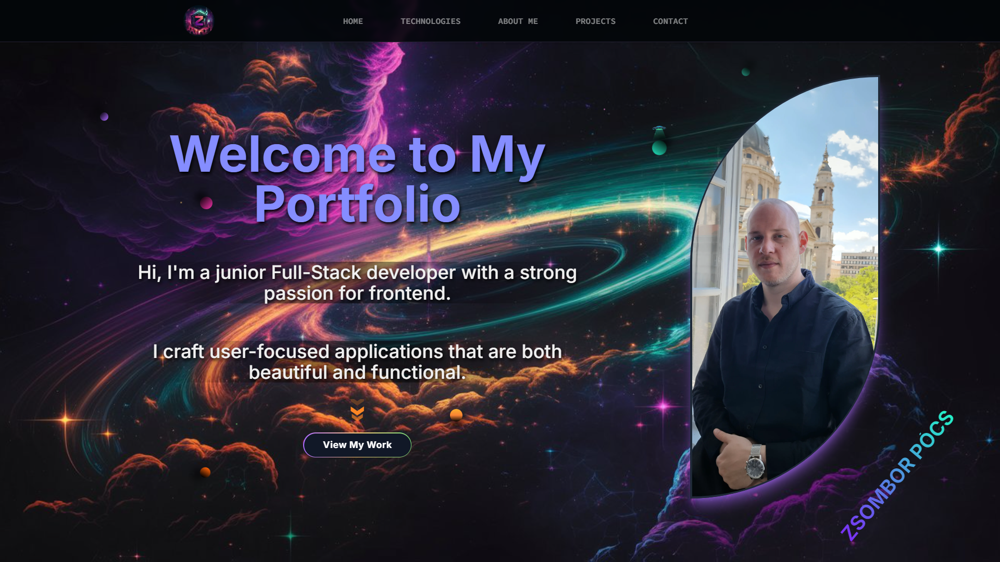
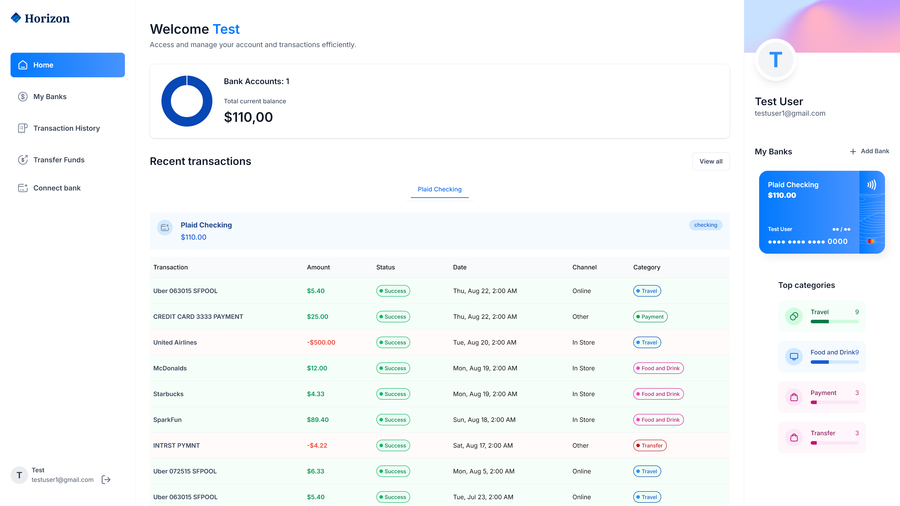

# 🎨 Zsombor Pócs - Portfolio Website

Welcome to my personal portfolio website! I'm **Zsombor Pócs**, a **junior full-stack developer** passionate about
creating modern, user-friendly web applications. This portfolio showcases my skills, projects, and the journey I've
embarked on as a developer.

> **Live Preview:** [Check it out here!](https://portfolio-ashy-phi-19.vercel.app)

## 🚀 Technologies Used

- **Next.js**
- **TypeScript**
- **Tailwind CSS**

## 🛠️ Additional Libraries & Tools

- **Framer Motion**: For smooth animations
- **SwiperJS** & **React Slick**: For carousels and sliders
- **Lottie**: For integrating captivating animations
- **React Icons**: To enhance visual appeal
- **EmailJS** & **Toastify**: For handling and styling the contact form
- **Zod**: For robust form validation

## 📑 Table of Contents

1. **Navbar**: Smooth navigation across different sections
2. **Hero Section**: A stylish landing page featuring my personal image
3. **Technologies Section**: Showcasing the programming languages and tools I use
4. **About Me**: Learn more about my background and see a more personal side of me
5. **Projects**: Displaying my personal projects with brief descriptions
6. **Contact Section**: Find me on GitHub, LinkedIn, or send me an email
7. **Project Detail Section**: In-depth information about each project

## 🛠 Features

- ✔️ **Responsive Design**: Works seamlessly across all devices.
- 🎞 **Smooth Animations**: Enhanced user experience with Framer Motion.
- 🖱️ **Interactive Elements**: Carousel sliders, parallax effects, and more.
- 📧 **Dynamic Contact Form**: Users can reach out directly via email with integrated form validation

## 📸 Why I Love This Project

This portfolio is more than just a website; it's a reflection of who I am as a developer. Building it has been an
incredible learning experience where I explored various tools and libraries, pushing the boundaries of my creativity.
Every section tells a part of my story, and I hope it gives you a glimpse into my passion for development.

## 💼 Projects

### Project 1: Banking website

- **Tech Stack**: Next.js, TypeScript, Tailwind CSS, Appwrite, Plaid, Dwolla, ShadCN
- **Live Demo**: [View Here](https://banking-six-delta.vercel.app/sign-in)

## 📬 Contact

- LinkedIn: [Zsombor Pócs](https://www.linkedin.com/in/zsombor-p%C3%B3cs/)
- GitHub: [Zsombinszky](https://github.com/Zsombinszky)
- Email: [pzsombor.dev@gmail.com](mailto:pzsombor.dev@gmail.com)

## 🔮 Future Plans

- [ ] Add dark mode support 🌙
- [ ] Implement a blog section 📝
- [ ] Try out GSAP , Three.Js ✨

## 🌐 Explore My Portfolio / Live Preview 🌐

Check out my portfolio to learn more about my work and the technologies I love to use. Whether you're a potential
employer, collaborator, or just someone curious about my journey, I hope you find something here that resonates with
you.
You can view my portfolio live at: [portfolio-ashy-phi-19.vercel.app](https://portfolio-ashy-phi-19.vercel.app)